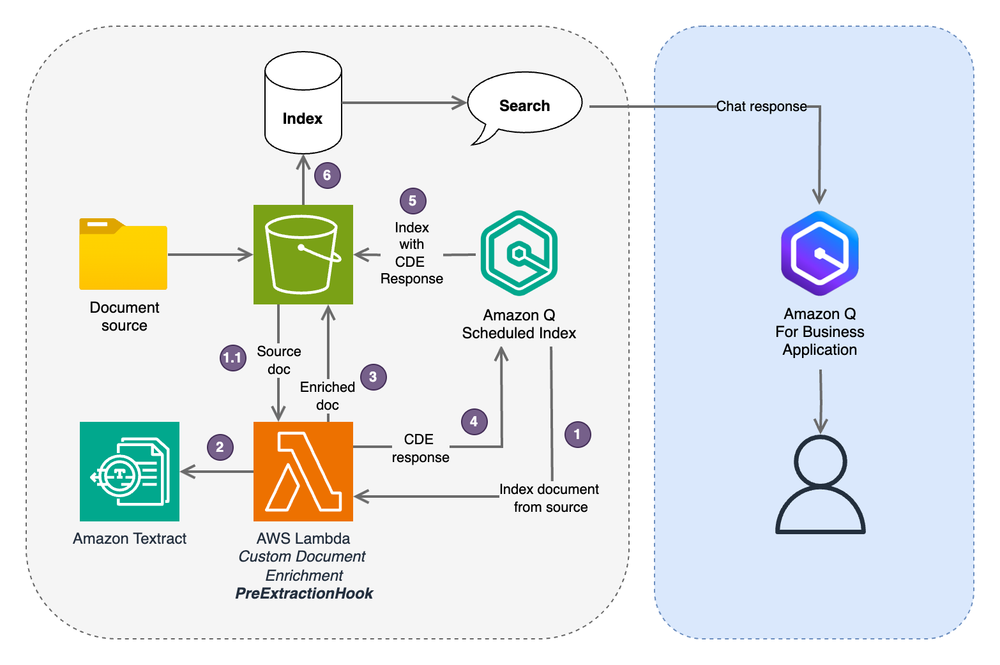
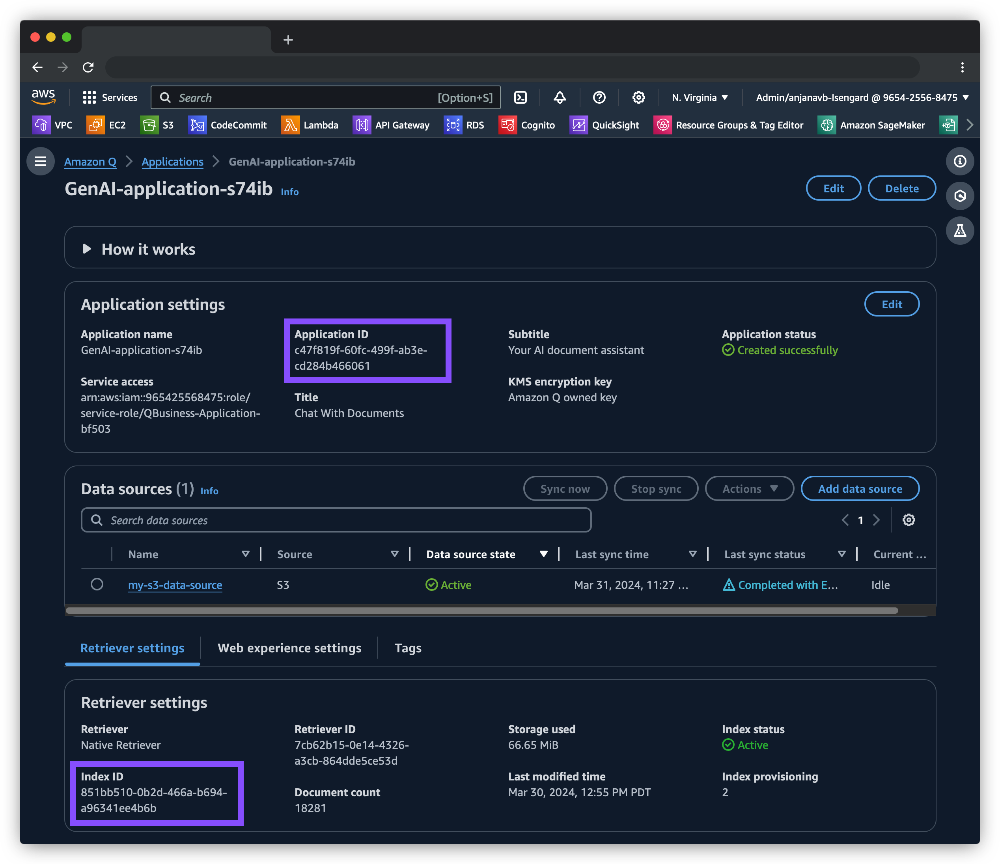
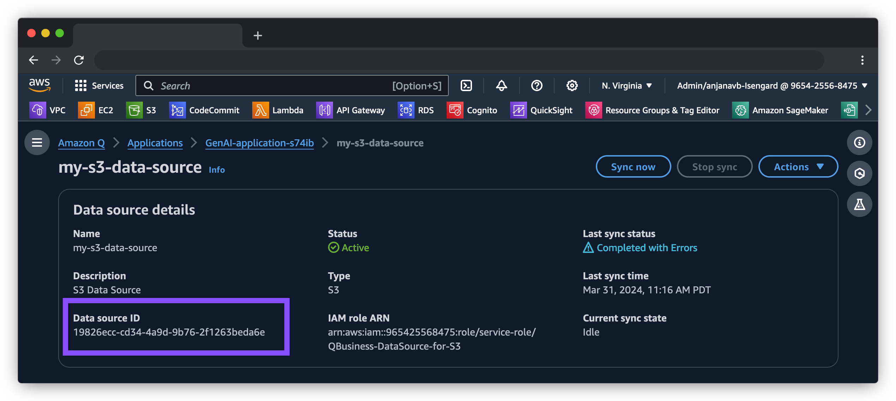
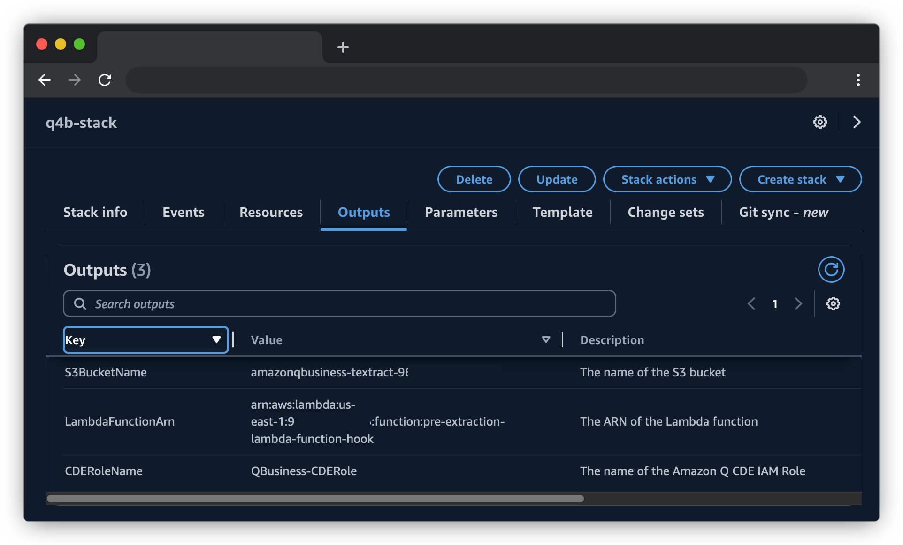
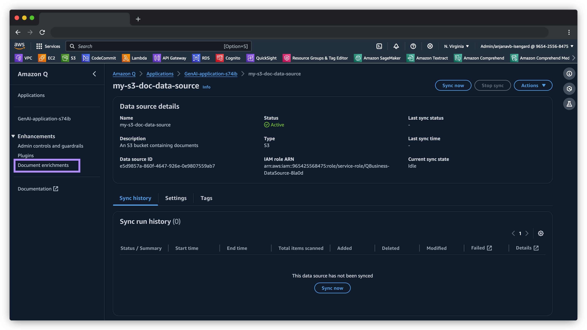
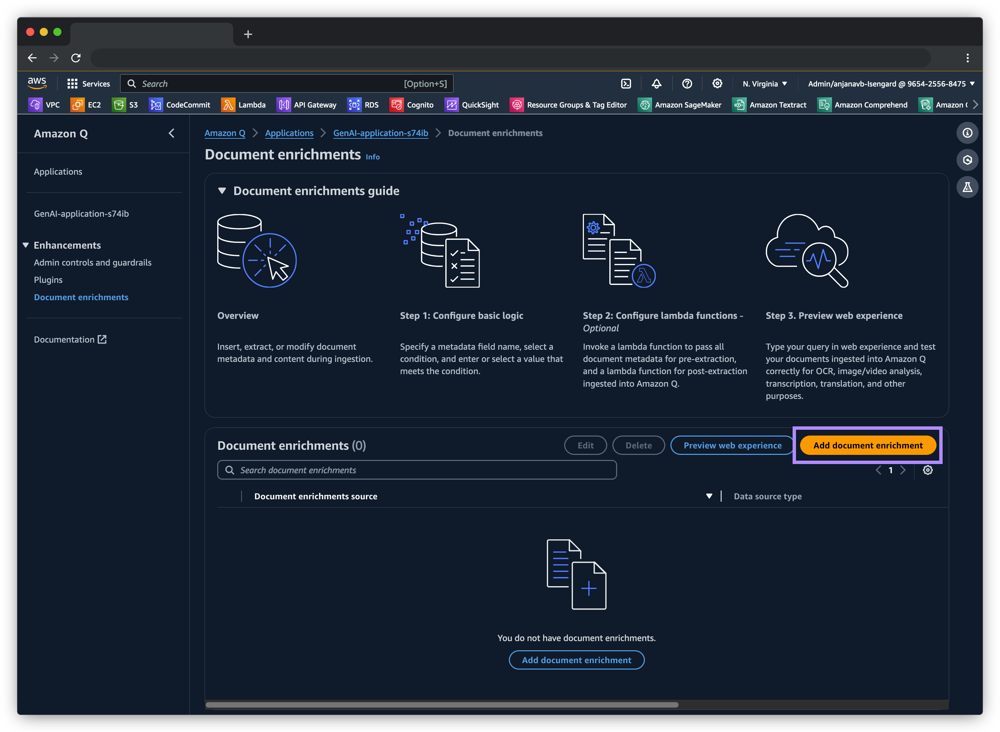
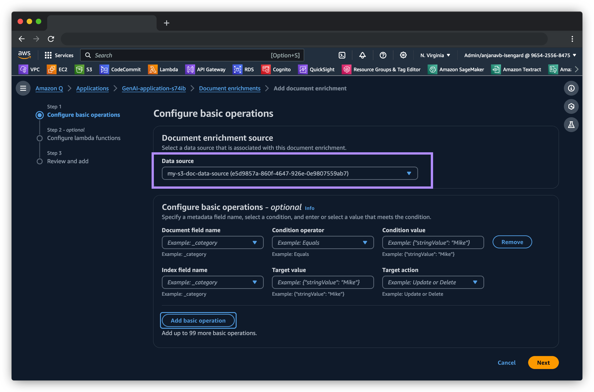
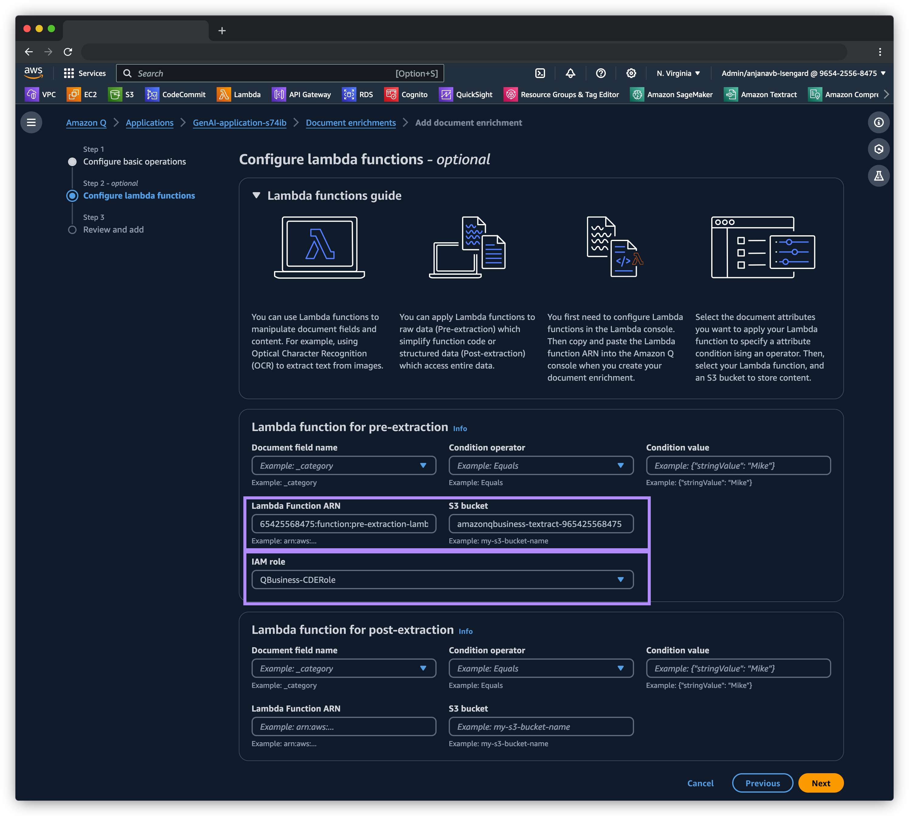
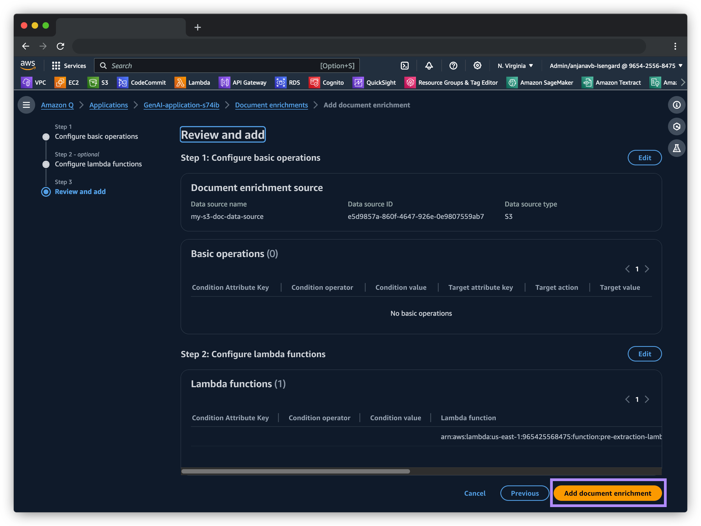

# Intelligent Document Processing with Amazon Q

A simple custom [Document Enrichment](https://docs.aws.amazon.com/amazonq/latest/qbusiness-ug/custom-document-enrichment.html) (CDE) for Amazon Q for Business with Amazon Textract. This enrichment enhances Amazon Q's chat Q&A ability by extracting linearized text from PDF, PNG, TIF, and JPG files using Amazon Textract's [LAYOUT](https://docs.aws.amazon.com/textract/latest/dg/layoutresponse.html) extraction feature.

## Overview

[Amazon Q](https://aws.amazon.com/q/) is a generative AI–powered assistant that can answer questions and provide summaries based on the data and information provided to the knowledge base. However, one of its limitations has been the lack of support for scanned documents and images for its knowledge base. This is where Amazon Q’s custom document enrichment capability comes into play.
In this post, we walk you all through a custom integration between two AWS services: Amazon Textract and Amazon Q that alleviates your document processing workflows to leverage AI for enhanced internal knowledge management.

## Custom document enrichment (CDE) in Amazon Q

The custom document enrichment feature in Amazon Q helps in controling both **what** documents and document attributes are ingested into your index and also **how** they're ingested. CDE enables you to create, modify, or delete document metadata and content when you ingest your documents into Amazon Q. Document enrichment offers two kinds of methods that you can use for your solution:

- **Basic operations**
- **Lambda functions**

We will be using the Lambda function method to prepare document attributes for advanced data manipulation using Amazon Textract.

## Solution Architecture

The folllowing architecture explains the Amazon Q document ingestion workflow by configuring a pre-extraction Lambda function. Here, the custom document enrichment is an AWS lambda function that can pre-process the scanned documents and images. So when users upload documents to S3, the pre-extraction lambda function gets triggered and makes API calls to Amazon Textract *Layout* and *Tables*.

Amazon Textract [*Layout*](https://aws.amazon.com/about-aws/whats-new/2023/09/amazon-textract-layout-feature-extract-paragraphs-titles-documents/) and [*Tables*](https://aws.amazon.com/blogs/machine-learning/announcing-enhanced-table-extractions-with-amazon-textract/) FeatureTypes enable customers to go beyond simple text extraction as these FeatureTypes can understand the context and visual cues of the information in scanned documents, which is crucial for maintaining the relevance of responses provided by Amazon Q.

  

## Create Amazon Q for Business Application

To deploy the CDE solution in your AWS accounts, you will need the following setup: 

- Create Amazon Q application by following the steps mentioned in this [documentation](https://docs.aws.amazon.com/amazonq/latest/business-use-dg/create-app.html).
- Configure a data source for your Amazon Q Business application preferably using the S3 data source connector in the Amazon Q application you created. The following [procedure](https://docs.aws.amazon.com/amazonq/latest/business-use-dg/s3-console.html) outlines how to connect Amazon Q to Amazon S3 using the AWS Management Console.

## Getting Started

1. Use the provided [Cloudformation template](./cfn-deploy.yaml), give your stack a name. 
2. Enter your Amazon Q for Business Application ID in the `Q4BApplicationID` field. Navigate to your Amazon Q for Business application, this can be found under "Application settings".
3. Enter your Amazon Q for Business Index ID in the `Q4BIndexID` field. This can be found under "Retriever settings".

  

4. Choose a **"Data Source"** where you wish to setup CDE. Enter the Data Source ID in the `Q4BDataSourceID` filed. This can be found in the "Data source details" page. _Note: if you don't have a data source you can create an S3 based Data Source using the documentation linked above._

  

5. Review the information in the Cloudformation template and then deploy.

The template deploys the following resources-
1. An S3 bucket version controled and with SSE
2. An IAM role for `PreExtractionHookConfiguration` for Amazon Q. (With no KMS support)
3. The CDE Lambda Function and a corresponding IAM role for the Lambda function with access to Amazon Textract, and Amazon S3.
4. Updates the Amazon Q for Business Data Source and configures the CDE Lambda as a `PreExtractionHookConfiguration`.

See the Cloudformation **Outputs** to view all the resources deployed.

  

 
#### **Is the CDE bucket the same bucket as my data-source bucket?**

You may have Amazon Q S3 based data source, that points to a bucket that receives (or contains) the documents. The CDE bucket "can" technically be the same bucket, but we recommend you separate them out. So in essence, your Data source's S3 bucket and your CDE bucket will have clear separation and you can manage them more efficiently. This bucket can be different than your Amazon Q data source bucket. This bucket is going to act as an intermediate bucket before your documents get indexed. Technically, documents can be coming from any data-source (like S3 based Data source, JIRA, etc.). The indexer will place the document in this bucket for your CDE function to perform enrichments. In short, the CDE bucket acts as an interim staging location for the Amazon Q indexer where it allows you to manipulate the content of "what goes into the index", before the indexer indexes the data.

  
## Adding CDE to your Amazon Q application

The cloudformation will automatically create all necessary resources and add the CDE Lambda to your Amazon Q for Business Data Source.

<!-- After you have all the necessary resources and the lambda function deployed in your AWS account, you can configure the CDE as follows:

- On the Amazon Q console, choose your Applications in the navigation pane. 
- Choose your Amazon Q application that you created as a prerequisite under Applications section. Then click on the data source for which you want to setup CDE from the **Data sources** section.
- On the selected data source screen, click on **Document enrichments** in the left menu. Note, your Q Application must have a **Data source** added for the **Document enrichments** option to appear in the left menu.

  

- Click on the **Add document enrichment** button to configure.

  

- Select the data source and select **Next**.

  

- In the **Lambda function for pre-extraction** section, you need the ARNs of the `preExtraction` Lambda function. Use the bucket that you created with the CloudFormation template or manually under **S3 bucket**.
- For IAM role, choose the CDE IAM role created earlier from the **Use the existing service role** dropdown and then Select **Next**.

  

- Choose **Add document enrichment.**

  

 -->

Voila! Now you’re ready to ingest scanned documents to your Amazon Q application! Once you sync your S3 data-source, your Amazon Q web experience is ready to be previewed, enhanced, and deployed.

## FAQs

#### 1. My customer has large scanned documents (100s of pages) in PDF format and want to use Amazon Q for Business. Can they use CDE?

Amazon Q limits the duration of Pre-extraction Lambda for CDE to max 5 mins, this essentially means that the Lambda would likely be unable to process large documents (like 100 page PDF) since extraction plus other checks done within the Lambda function could easily exceed the 5 min time limit. If the customer's documents deals with large PDFs then using CDE may not be the best approach.

#### 2. My customer has a large (thousands or millions) archive of scanned documents that they want to use Amazon Q for Business. Can they use CDE?

The CDE Lambda may encounter throttling errors with Amazon Textract if there's a large number of documents that are attempting to get indexed by Amazon Q. While the CDE uses Amazon Textract's async API, there are still limits to how many async jobs can be launched per second, and how many concurrent async extraction jobs can run at any given time within an account/region. If your workload involves indexing large number of large multi-page documents, Amazon Q's Pre-extraction CDE may not be the right choice. In that case you would want to establish a more elaborate document extraction pipeline (see [guidance](https://aws.amazon.com/solutions/guidance/low-code-intelligent-document-processing-on-aws/) and [samples](https://github.com/aws-solutions-library-samples/guidance-for-low-code-intelligent-document-processing-on-aws)) to perform document extraction in advance, and then use the output of the extraction pipeline as a data source for your Amazon Q for Business application.

#### 3. My customer has relatively small documents in mostly PDF format coming in from a third party system. Can they use CDE with Amazon Q for business on those documents?

Yes. If Amazon Q provides connectors for the third party system then CDE can be used, if 3rd party connector isn't available then the customer can use an S3 based data source and put their documents in the S3 bucket for indexing.

#### 4. My customer has a collection of MS Word docs, Excel docs, PowePoints, and HTML pages. Will this CDE work on these documents?

This CDE specifically handles scanned documents in PDF, TIF, PNG or JPEG format and uses Amazon Textract as an OCR engine for text extraction. For any other types of files, the CDE will simply pass through the original document to the indexer. If the customer's document is one of the [supported document types](https://docs.aws.amazon.com/amazonq/latest/qbusiness-ug/doc-types.html) then they should get indexed normally by Amazon Q.

#### 5. My customer wants to redact/scrub PII information from the documents before being used by Amazon Q for Business, can this CDE perform PII redaction?

No. However, depending on what PII you want to redact you can customize the Lambda function to use additional services such as Amazon Bedrock or Amazon Comprehend PII to detect PII and perform redaction on plain text data. If the documents are scanned images (PDF, TIF, PNG, JPG) then you will need to use Amazon Textract as an OCR engine first and then perform PII detection and redaction. However, please note that CDE Lambda excution time is limited to 5 mins max, so all operations must complete within that timeframe for a given document.

#### 6. The CDE is deployed correctly and the documents are being extracted and indexed properly, however Amazon Q is either giving incorrect or irrelevant answers.

Follow [this page](https://w.amazon.com/bin/view/AmazonPlato/CustomerIssues) to report inaccurate or irrelevant responses.

#### 7. I am in a hurry to show a demo with this CDE to my customer, is there a pre-deployed Amazon Q for Business Application I can use?

No. It is recommended that you deploy your own application and create your own data-scource and then deploy the Cloudformation template provided in this repo for demo purposes in your own isengard account. You can follow the steps in [this document](https://quip-amazon.com/vtlzABK2QiNL/How-to-Integrate-Midway-Auth-with-Plato-ExpertQ) to setup authentication with Amazon Midway.

#### 8. I deployed the CDE and my data source has documents, but Amazon Q isn't able to answer questions.

Make sure you double check the indexing schedule of your data source. If the indexing is set on a schedule then you can either manually start an on demand sync or wait for the scheduled sync to run. If the data source index is set to manual schedule then you will have to run the sync on the data source manually using the `Sync now` button and wait for the indexing to complete. If you encounter errors, check the CloudWatch logs for the reasons for the error. If you are confident that you have run the sync (indexing) after the CDE deployment then check the `.txt` file created under the `cde_output/layout/` prefix in the CDE bucket. The file would be typically named as `<your_document_name>.txt`. Inspect the content of the file to check if the content looks correct.

#### 9. None of these answer my questions, I want to know if 👉insert_question_here👈

Hop on to the `#amazon-q-business-interest` channel and ask away, don't forget to check-out the pinned resources. You can create a [SpecReq](https://spec-req.sales.aws.a2z.com/create-request) as well.